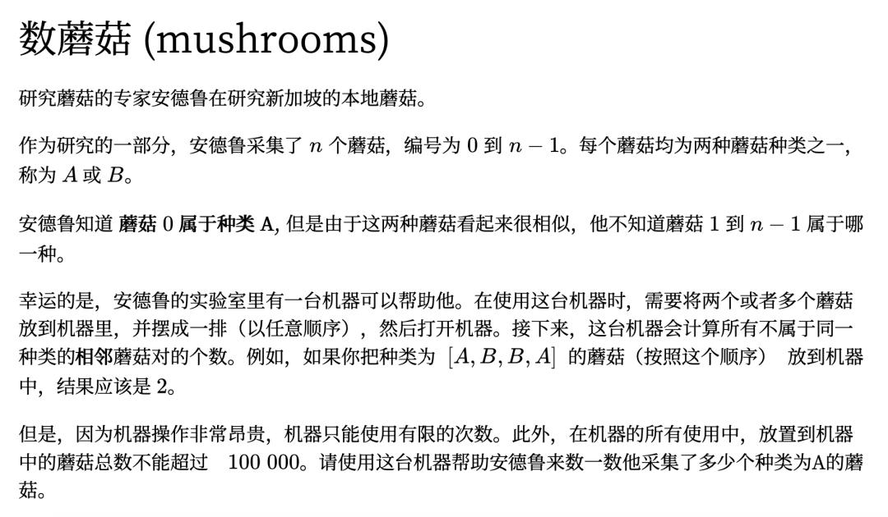

There a lot of marshroom, which has two differnet kind A and B. there is machine which can tell how many pair you put in. only thing you know is the marshroom[0] is A type. the maximun marshroom you can put in the machine is 10000 at a time. write a program to tell how many A and B in those marshroom.

[比赛](https://www.thepaper.cn/newsDetail_forward_9274304)



## 数蘑菇

研究蘑菇的专家Adrew在研究新加坡的本地蘑菇。
作为研究的一部分，Andrew采集了n个蘑菇，编号为0到n-1。每个蘑菇均为两种蘑菇种类之一，称为A或B。
Andrew知道蘑菇0属于种类A，但是由于这两种蘑菇看起来很相似，他不知道1到n-1属于哪一种。
幸运的是，Adrew的实验室里有一台机器可以帮助他。在使用这台机器时，需要将两个或者多个蘑菇放到机器里，并摆成一排（以任意顺序），然后打开机器。接下来，这台机器会计算所有不属于同一种类的相邻蘑菇对的个数。例如，如果你把种类为[A,B,B,A]的蘑菇（按照这个顺序）放到机器中，结果应该是2。
但是，因为机器操作非常昂贵，机器只能使用有限的次数。此外，在机器的所有使用中，放置到机器中断蘑菇总数不能超过100,000。请使用这台机器帮助Adrew来数一数他采集了多少种类为A的蘑菇。

Adrew, an expert in mushrooms, is studying local mushrooms in Singapore.
As part of the research, Andrew collected n mushrooms, numbered from 0 to n-1. Each mushroom is one of two mushroom species, called A or B.
Andrew knew that mushroom 0 belonged to type A, but because the two mushrooms looked very similar, he didn't know which one 1 to n-1 belonged to.
Fortunately, there is a machine in Adrew's laboratory that can help him. When using this machine, you need to put two or more mushrooms in the machine, arrange them in a row (in any order), and then turn on the machine. Next, this machine will calculate the number of all adjacent mushroom pairs that do not belong to the same species. For example, if you put mushrooms of type [A,B,B,A] (in this order) into the machine, the result should be 2.
However, because machine operation is very expensive, the machine can only be used a limited number of times. In addition, in all uses of the machine, the total number of mushrooms placed on the machine cannot exceed 100,000. Please use this machine to help Adrew count how many mushrooms of type A he has collected.

[](countMushrooms.py)

analysis:
1. 最笨的办法是拿已知的mushrooms[0]，和其他的mushrooms一个一个的对比。

```py
def getPair1(mushroom1, mushroom2):
    return mushroom1==mushroom2 and 0 or 1

def countMushrooms(mushrooms):
    a = 1
    for i in range(1, len(mushrooms)):
        a += getPair1(mushrooms[0], mushrooms[i])
    return a
```
2. 这不符合题目的描述，题目中已经说明，开机非常昂贵，一定要把尽可能多的蘑菇放到机器中测试。而机器只能给出邻近蘑菇对的数量。

## cases 1:
[A,A,A,B,B,B,A,A]
return 2 based on description above

