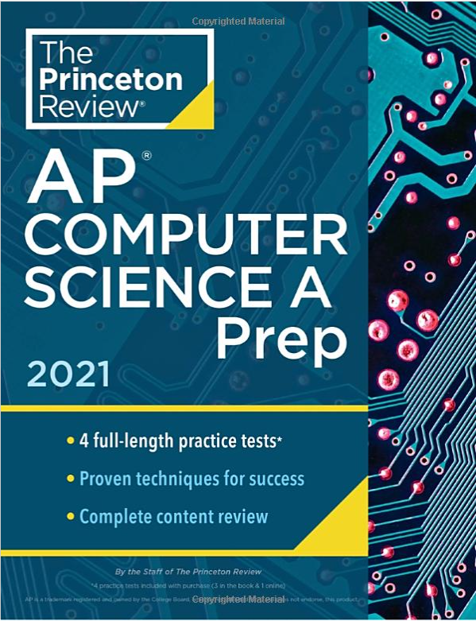
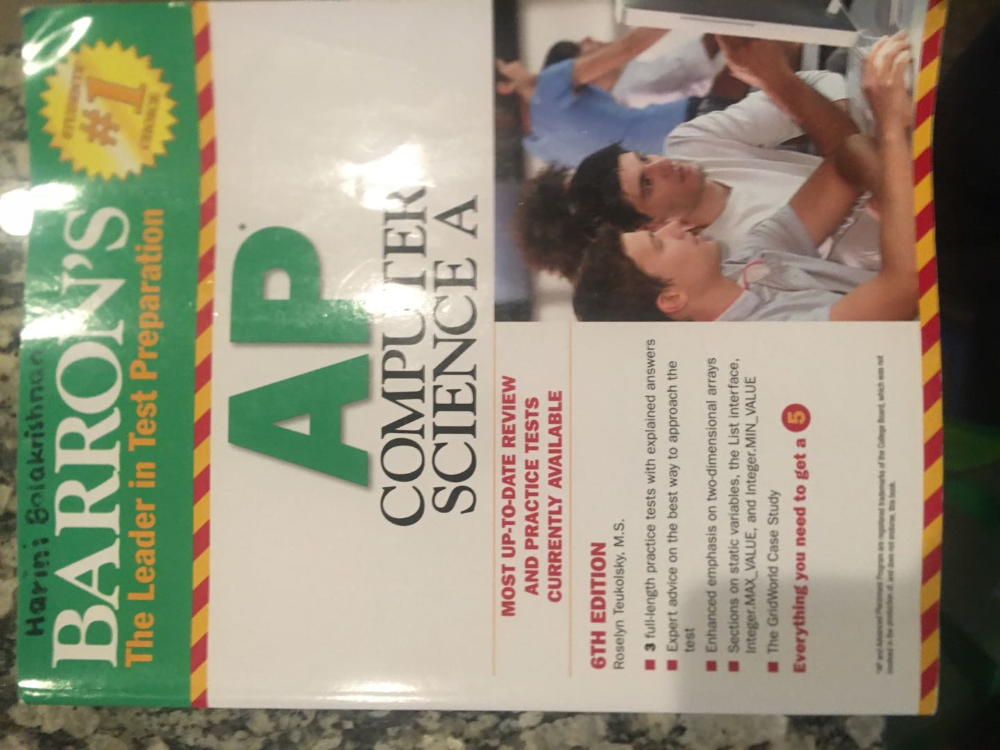

# AP Computer Science 课程简介 
<div >
<center><h3>&#x2501;&#x2501;华夏中文学校</h3></center>
</div>

## Course Goal and Suitable Students
This course is aimed at students reviewing for the AP Computer Science A exam. It is suitable for high school students who complete an AP course, ready to take the exam. In this course, we mainly focus on how to answer questions quickly, of course, correctly.

We also help students understand the Java language basic concept, make sure they are not only can "guess" the answer but know why the answer is correct.

We teach students other methods to understand questions better, such as debugging, unit testing, logging, markdonw document, and more.

## Text Book
We will recommand [AP COMPUTER SCIENCE A Prep - 2021] book as basic text book in this class.

<div>
<center></center>
</div>
Other old edition text book is also good for this course.
<div>
<center></center>
</div>

## Eclipse IDE Tool
We will use Eclipse as Java Programming tool for writing, running and debugging the Java source code. 
* Create new project, new package, new class.
* Debug and Run the source code.
* Use different perspective
* Write Markdown documents

[Eclipse Download Website](https://www.eclipse.org/downloads/)

## Java Language Coverage
* Data type, Operators, Control structures
* OOP concept, Methods, Subclasses, Abstract classes, Interfaces
* Array, Two-dimensional arrys, ArrayList
* Selection Sort, Insertion Sort, Merge Sort, Binary Search
* Bug class, BoxBug class, Critter class, ChameleonCritter class

## Sample Exam Question
1. What will be output from the following code segment, assuming it is in the same class as the doSomething method?
```java
int[] arr = {1,2,3,4};
doSomething(arr);
System.out.print(arr[1] + " ");
System.out.print(arr[3]);

public void doSomething(int[] list){
    int[] b = list;
    for (int i=0; i<b.length; i++)
        b[i] = i;
}
```
```
(A) 0 0
(B) 2 4
(C) 1 3
(D) 0 2
(E) 0 3
```
We will teach students what is the purpose of this test, which is testing students who understand "pass by value" or "pass by reference". We believe if students understand the concept behind the scene, they will be able to answer all similar questions, regardless different looks of questions. This is also the main goal of this course.