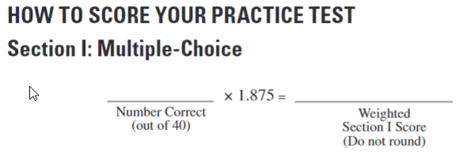
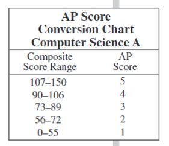
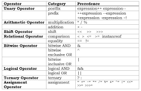
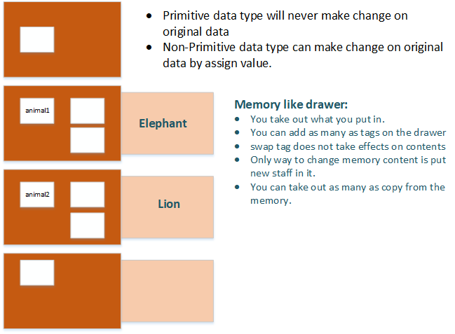

# 华夏中文学校 AP Computer Science
[Princeton Review](https://dashboard.princetonreview.com/)

## Table of Contents
- [华夏中文学校 AP Computer Science](#华夏中文学校-ap-computer-science)
  - [Table of Contents](#table-of-contents)
  - [Training NOT Learning](#training-not-learning)
  - [How to crack?](#how-to-crack)
  - [Score Conversion](#score-conversion)
  - [Data Type](#data-type)
  - [Precedence of Arithmatic operators](#precedence-of-arithmatic-operators)
  - [Method Pass by Reference](#method-pass-by-reference)
  - [Create Instance of Class](#create-instance-of-class)
  - [Array](#array)
  - [String](#string)
  - [Operator](#operator)
  - [Loop](#loop)
  - [If-else](#if-else)
  - [Function](#function)
  - [Data Structure](#data-structure)
  - [Complete Class](#complete-class)
    - [Section II](#section-ii)
  - [Questions](#questions)
  - [Answers](#answers)
  - [Referencea](#referencea)

## Training NOT Learning
AP Computer class is a training class, not learning class, which means we will repeat answer same kind of questions again and again till we can answer the question correct subconsciousl.

What I suggest is collection as much questions as possible for the future practice just before you take the exam.

I encorage you generate a sequence of random number between your collection, do the question set everyday. for instance, you have 200 questions, generate 10 random numbers betwee 1 and 200, and do those 10 questions everyday.

Write the Java program, generate 10 random numbers between given range.

## How to crack?
[Quiz-1](quiz1.pdf)
* Language Basic
  1. Consider the following code segment: 
   
   ```java
    1   int a 10;
    2   double b = 10.7; 
    3   int d = a + b;  
   ```
    Line 3 will not compile in the code segment above. With which of the following statements could we replace this line so that it compiles? 

    ```java
    I.      int d = (int) a + b
    II.     int d = (int) (a + b);
    III.    int d = a + (int)b; 
    ```
    ```
    (A) I 
    (B) II
    (C) III 
    (D) I and III
    (E) II and III   
    ```
* Exclution method
  1. Consider the following code segment. 

     ```java
     1    int a = 11; 
     2    int b = 4;
     3    double x = 11;
     4    double y = 4;
     5    System.out.print(a/b) ;   
     6    System.out.print(", ") ;   
     7    System.out.print(x/y) ;   
     8    System.out.print(", ") ;   
     9    System.out.print(a/y) ;   
     ```
     What is printed as a result of executing the code segment? 
     ```
     (A) 3, 2.75, 3 
     (B) 3,2.75,2.75 
     (C) 2,3.2 
     (D) 2, 2.75,2.75 
     (E) Nothing will be printed because of a compile-time error. 
     ```
  >a/b=2,(A),(B) and (E) wrong; should have 3 output, (C) wrong; (D) is answer.
* Output Table
  1. Consider the following code segment. 

    ```java
    int val1 = 2, val2 = 22, val3 = 78; 
    while (val2 % val1 == 0 || val2 % 3 == 0 ){
      val3++; 
      val2--; 
    }
    ```
    What will val3 contain after the code segment is executed?
    ```
    (A) 77
    (B) 78 
    (C) 79 
    (D) 80
    (E) None of the above  
    ```
  val2 | val3
  |---|---|
  |21 |79 |
  |20 |80 |
  |19 |81 |
* Reverse thinking
  1. Assuming all other statements in the program are correct, each of the following statements will allow the program to compile **EXCEPT**

      ```java
      (A) system.out.print(1);
      (B) System.out.print("1");  
      (C) System.out.print(side1); 
      (D) System.out.print"side1");
      (E) All of the above statements will compile. 
  >Because the **EXCEPT**, think about which one is a **FALSE** statement.
* Thinking the way of the tester (allow tester make mistake)
  1. Which of the following class declarations would cause a compile-time error? Assume the rest of the code compiles as intended. 

  	```java
  	(A) public class Calculus
  	(B) public class apCalculus  
  	(C) public class APCalculus 
  	(D) public class 4Apcalculus 
  	(E) public class APCalculus extends Calculus 
  	```
  1. Assuming all other statements in the program are correct, each of the following statements will allow the program to compile **EXCEPT**

    ```java
    (A) //This is a comment
    (B) /* This is a comment*/ 
    (C) // myName is a good identifier name 
    (D) // myname is a good identifier name 
    (E) All of the above statements will compile. 
    ```
  Don't make yourself too good!

## Score Conversion
* Weighted score
  




---
[Table of Contents](#table-of-contents)

## Data Type


## Precedence of Arithmatic operators
* Question1_3.java;
  **Java Operator Precedence**
  
Operators	|Precedence
|---        |---        |
postfix increment and decrement	|++ --
prefix increment and decrement, and unary	|++ -- + - ~ !
multiplicative	|* / %
additive	|+ -
shift	|<< >> >>>
relational	|< > <= >= instanceof
equality	|== !=
bitwise AND	|&
bitwise exclusive |OR	^
bitwise inclusive |OR	|
logical AND	|&&
logical OR	|||
ternary	|? :
assignment	|= += -= *= /= %= &= ^= |= <<= >>= >>>=



* 口诀
```
一元先，二元后，
先乘除模后加减，
左右移，小大等，
位操作后与或算，
三元算符在后头，
赋值永远最后建。
```

---
[Table of Contents](#table-of-contents)

## Method Pass by Reference
* Question4.java; String is immutable





* PassByReference.java; swap student, int, String

[Quiz 2](quiz2.pdf)
  
[String class document](https://docs.oracle.com/javase/7/docs/api/java/lang/String.html)


## Create Instance of Class
* Constellation.java; 
  - Question5: contructor arguments signature
  - Question6: 


## Array
* Array1.java; passed by reference

## String
* Question10.java; memory location
* Question11.java; String index, String.length(), String.substring(), List.size(), array.length; String==char[]

## Operator
* Question1_3.java; precendence of operators,
* Question9.java; logical operator
  
## Loop
* Question12.java; Embedded for-loop count
* Question14.java; 1. how many symble? 2. start with symble or space?
* Question15.java; stop calculate when the number reach the point.

## If-else
* Question7.java;
* Question8.java;


## Function
* Constellation.java; Constructor signature
* Question17.java; recursion call

## Data Structure
* Question40.java; Binary search

## Complete Class
### Section II
* DiceSimulation.java;
    - understand Math.random().
>static double	random()
Returns a double value with a positive sign, greater than or equal to 0.0 and less than 1.0.

* CalorieCount.java;

* Tour.java (main: TravePlan.java)

* SeatingChart.java (main); Name.java
  
[Official Documentation](https://docs.oracle.com/javase/8/docs/api/java/lang/Math.html#random--)

## Questions
* Question1_3.java; Precedence of operators, int/int->int, escape sequence [Perecedence](#precedence-of-arithmatic-operators)
* Question4.java; Pass by reference [Pass By Reference](#method-pass-by-reference)
* Question5: Constellation.java; Constructor signature
* Question6: Constellation.java;
* Question7.java; if-else
* Question8.java; if-else, String.compareTo(), sort()
* Question9.java; logical operator
* Question10.java; memory location
* Question11.java; string==>character array
* Question12.java; loop
* Question13.java; loop & if-else, try small n
* Question14.java; 1. how many symble? 2. start with symble or space?
* Question15.java; stop calculate when the number reach the point.
* Question16.java; loop, if-else
* Question17.java; recursion call
* Question18: Tile.java; constructor varaible assignment
* Question19: Tile.java; recursion call, method overloading
* Question20: Tile.java; modifier
* Question21.java; exclustion method, + table list
* Question22.java; array reference (tag)
* Question23.java; array reference
* Question24.java; different answer
* Question25.java; for each loop
* Question26.java; pass by reference
* Question27.java; ArrayList type sensitive
* Question28.java; array remove, table, remove index is little tricky
* Question29.java; recursion call
* Question30: Question29.java; 2D array index
* Question31.java; exclusion
* Question32.java; 2-D array index
* Question33: Percussion.java; constructor and inheritence
* Question34: Xylophone.java; method signature
* Question35: XylophoneTester.java; A **client** program
* Question36: Dog.java; SportingDog.java; Retriever.java; DogTester.java; constructor
* Question37: DogTester.java; constructor + toString()
* Question38.java; wrong coding for pow() function
* Question39.java; understand the recursion function call
* Question40.java; Binary search
 
---
[Table of Contents](#table-of-contents)

## Answers
1E 2D 3D 4A 5C 
6E 7B 8A 9E 10C 
11C 12D 13A 14C 15B 
16B 17D 18C 19B 20D 
21B 22E 23B 24D 25A 
26C 27E 28A 29B 30D 
31D 32B 33B 34S 35C 
36D 37E 38E 39D 40A 
## Referencea
[MCQ for Java](https://www.javatpoint.com/java-mcq)