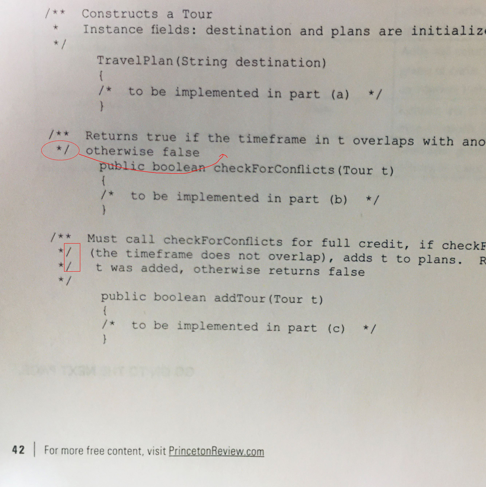
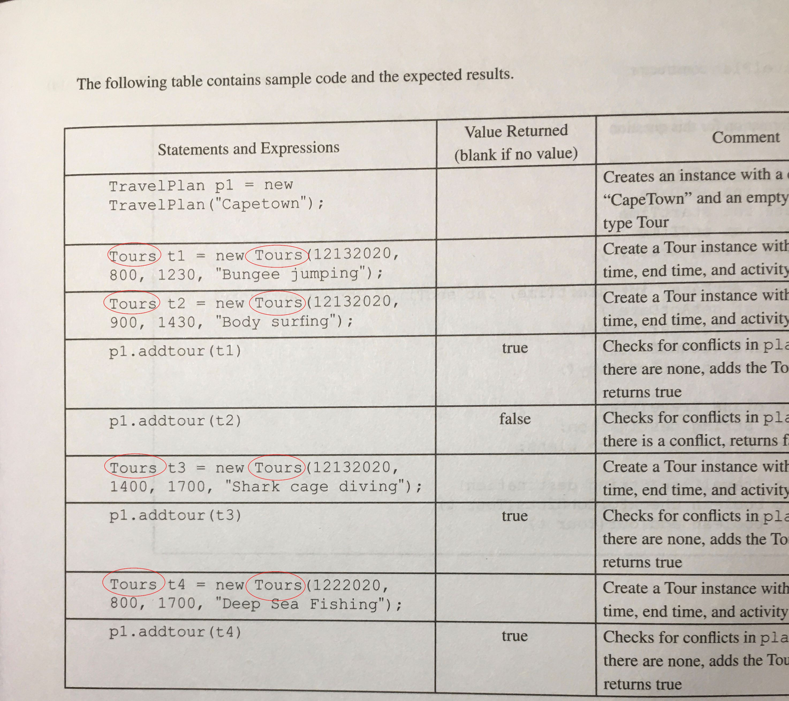

# AP Computer Science Error Collections:

Title: AP COMPUTER SCIENCE A  Prep 2021

ISBN: 978-0-525-56949-7

ISSN:2690-5345

[Send email to](editorialsupport@review.com)

## Section I
Page | Question | Error |Correction |Description
|---|---|---|---|---|
20 | 16-line2      | String s = "map "; |String s = "map"    |wrong result.
59 | 24-(D)    | the location |the locations |Answer sheet build wrong table based on the question
27 |25-line56      |cause compiler error |should be removed |Defined variable cannot be defied again within the same scope.
33 |35-(D) |if (x2.weight.equals(x3.weight) | if (x2.weight.equals(x3.weight)) |missing ), which is not the test purpose.
35 |38 | no correct answer listed| change line 4: return 1; |mystery() is not defined

## Section II
Page | Question | Error |Correction |Description
|---|---|---|---|---|
38 | 1-Value Returned/Comment |A DiceSimulation d1...|A DiceSimulation s1...|No d1 declared in the code.
42 |3 |*/ otherwise false; */ (the) | otherwise false */|comments should be between /** and */, next following couple of lines have the same issue, if you type this code in Eclipse, will cause a lot of errors.
43 |table row 2|Tours t1 = new Tours(...|Tour t1 = new Tour(...|No Tours class defined
47 |4 |Seating Chart|SeatingChart|class name should not include a space
48 |expected result | 5 rows | should be 4 rows |something wrong
65 |(a),(b),(c)|no Canonical Code | |Answer part shold provide Canonical Code
66 |(b)|additional } on the end | should be removed | unbalanced {}
122|8|int n = t.IndexOf("the");|int n = t.indexOf("the");|indexOf() method start with lowercase.
144|6-(B)|The value ... is ... |The values ... are ...| two values should use plural
144|6-(C)|The value ... is ... |The values ... are ...| two values should use plural
145|after table|Choice (B) is the only false statement| Choice (B) is true statement|someNum==2 for both I and II 

**Error on page 42:**



**Error on page 43:**



## Bad sample code
Consider the sample question on page 104 and 107:
* Sample on page 104 says
  1. Assuming all other statements in the program are correct, each of the following statements will allow the program to compile **EXCEPT**

    ```java
    (A) //This is a comment
    (B) /* This is a comment*/ 
    (C) // myName is a good identifier name 
    (D) // myname is a good identifier name 
    (E) All of the above statements will compile. 
    ```
    ... Therfore, (E) is correct.
* Sample on page 107 says
  2. Assuming all other statements in the program are correct, each of the following statements will allow the program to compile **EXCEPT**

    ```java
    (A) system.out.print(1);
    (B) System.out.print("1");  
    (C) System.out.print(side1); 
    (D) System.out.print"side1");
    (E) All of the above statements will compile. 
    ```
    ... Therefor, (C) is the answer. ...

Both questions are the same, but the answer really confuse reader. It seems to me on question 1, the choice (E) is treated as a Java code, but on question 2, choice (E) is **NOT**. Beside, if (C) is the exception, and (E) will be false statement no matter it is treated as Java code or not.


Feel free to contact to me for any reason.

Error Finder Name: John Q. Wang

Email: wangqianjiang@live.com

Phone: (281) 818-2512
