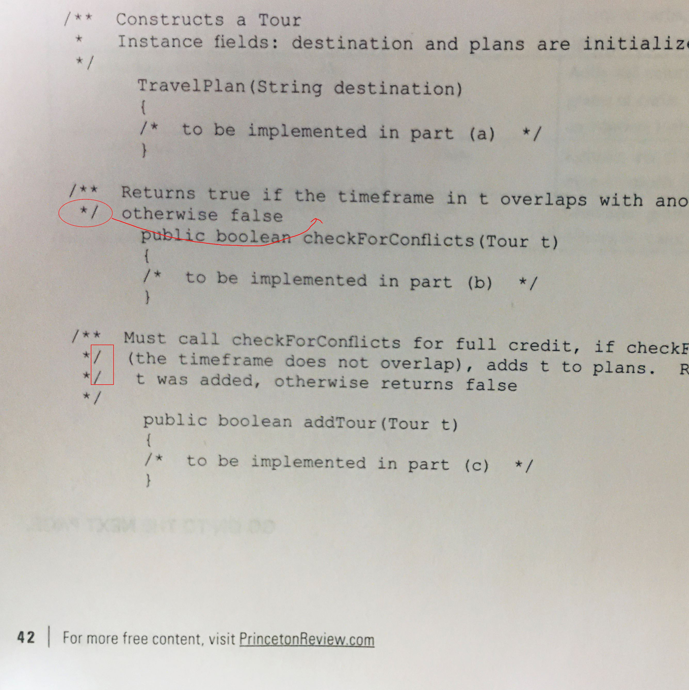
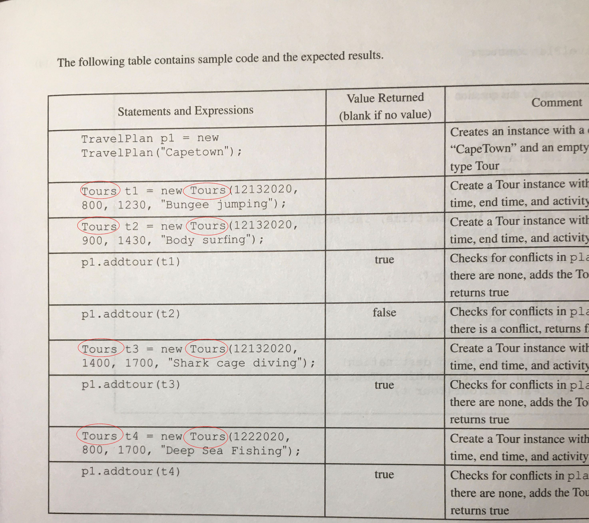

# AP Computer Science Error Collections:

Title: AP COMPUTER SCIENCE A  Prep 2021

ISBN: 978-0-525-56949-7

ISSN:2690-5345

[Send email to](editorialsupport@review.com)

## Section I
Page | Question | Error |Correction |Description
|---|---|---|---|---|
20 | 16-line2      | String s = "map "; |String s = "map"    |wrong result.
59 | 24-(D)    | the location |the locations |Answer sheet build wrong table based on the question
27 |25-line56      |cause compiler error |should be removed |Defined variable cannot be defied again within the same scope.
28 |27-II|alist1.add((int) 4.5);|alist2.add((int)4.5);|according to answer, use alist2 instead of alist1 
33 |35-(D) |if (x2.weight.equals(x3.weight) | if (x2.weight.equals(x3.weight)) |missing ), which is not the test purpose.
35 |38 | return b + pow(b, x-1);| return b * pow(b-x-1); |mystery() is not defined

## Section II
Page | Question | Error |Correction |Description
|---|---|---|---|---|
38 | 1-Value Returned/Comment |A DiceSimulation d1...|A DiceSimulation s1...|No d1 declared in the code.
42 |3 |*/ otherwise false; */ (the) | otherwise false */|comments should be between /** and */, next following couple of lines have the same issue, if you type this code in Eclipse, will cause a lot of errors.
43 |table row 2|Tours t1 = new Tours(...|Tour t1 = new Tour(...|No Tours class defined
47 |4 |Seating Chart|SeatingChart|class name should not include a space
48 |expected result | 5 rows | should be 4 rows |something wrong
65 |(a),(b),(c)|no Canonical Code | |Answer part shold provide Canonical Code
66 |(b)|additional } on the end | should be removed | unbalanced {}
122|8|int n = t.IndexOf("the");|int n = t.indexOf("the");|indexOf() method start with lowercase.
144|6-(B)|The value ... is ... |The values ... are ...| two values should use plural
144|6-(C)|The value ... is ... |The values ... are ...| two values should use plural
145|after table|Choice (B) is the only false statement| Choice (B) is true statement|someNum==2 for both I and II 
147|1-(E)|for (int x=1; x<=5;x++|for (int x=1; x<=5;x++)|miss ) ant end
149|4|... !(a | | b);|... !(a || b);|the code will not compile
150|7|System.out.println(x)|System.out.println(x);|miss ; at end


**Error on page 42:**



**Error on page 43:**



## Sample questions of Controversy
Consider the sample question on page 104 and 107:
* Sample on page 104 says
  1. Assuming all other statements in the program are correct, each of the following statements will allow the program to compile **EXCEPT**

    ```java
    (A) //This is a comment
    (B) /* This is a comment*/ 
    (C) // myName is a good identifier name 
    (D) // myname is a good identifier name 
    (E) All of the above statements will compile. 
    ```
    ... Therfore, (E) is correct.
* Sample on page 107 says
  2. Assuming all other statements in the program are correct, each of the following statements will allow the program to compile **EXCEPT**

    ```java
    (A) system.out.print(1);
    (B) System.out.print("1");  
    (C) System.out.print(side1); 
    (D) System.out.print("side1");
    (E) All of the above statements will compile. 
    ```
    ... Therefor, (C) is the answer. ...

Both questions are the same, but the answer may mislead reader. I think these two questions contradict each other. 

In question 1, the choice "(E) All of the above statements will compile." is metalanguage, and freqently used in multiple-choice quiz, not Java language code. In the question, "EXCEPT" is used which tells reader to find a false statement, but (E) is a true statement, and should not be the answer. 

In question 2, if side1 is defined in other place in the program, (C) also compile. In the question, it is not clear, if the side1 is defined or not, reader cannot assume it is defined, cannot assume it is NOT define either. If reader assume the above 4 lines of Java code is the only 4 lines in the main() method, then the answer is right, but it is rely on reader's assumtion.

## Sample code has poor performance
* On page 66, the book gives a Connonical Solution for question 4(a). Obviously, the idea is put ordered name array item into random chosen seat location. The performace is poor, since when most seats are occupied, it is harder to find empty location, besides, program need check the empty status all the time and generage a lot of random number for seat column and row. As a sample code solution, I think, the following code maybe better, which puts random name array item into fixed seat location:

```java
	SeatingChart(Name[] names, int r, int c) {
		List<Name> list = Arrays.asList(names);
		Collections.shuffle(list);
		int count = 0;
		chart = new String[r][c];
		for (int i = 0; i < chart.length; i++) {
			for (int j = 0; j < chart[0].length; j++) {
				chart[i][j] = "";
				if(count<list.size()) {
					chart[i][j] = list.get(count++).toString();
				}
			}
		}	
	}
```
As you can see, these code is shorter and more efficient.

---

---
Feel free to contact to me for any reason.

Error Finder Name: John Q. Wang

Email: wangqianjiang@live.com

Phone: (281) 818-2512

