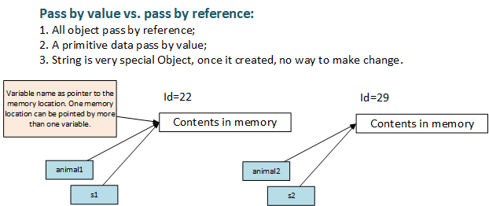

<h1>Java Knowledge Points</h1>

## Data type
1. once variable type is defined, cannot be changed to other data type;
2. var can be used for any data type;

## Pass by value vs. Pass by reference



## Operators Precedence

1. *,/,% ==> +,- ==> assignment operators(=, +=, -=, *=, /=, %=)

## math return type
1. all integer return integer, cut off dicimal point;
2. one double return double;
3. one float return float;

## recursive method
1. termination condition
2. condition changes for each call
3. condition changes towards termination

## escape sequence
```java
String s = "\^";
```
where the '\' character within double quotes is called escape sequence, which is used for invoking special character.