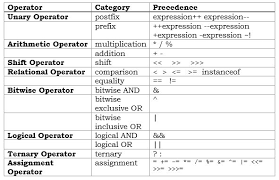

# Java Language Basic

## Precedence of Arithmetic Operators
* Java Operator Precedence
  
Operators	|Precedence
|---        |---        |
postfix increment and decrement	|++ --
prefix increment and decrement, and unary	|++ -- + - ~ !
multiplicative	|* / %
additive	|+ -
shift	|<< >> >>>
relational	|< > <= >= instanceof
equality	|== !=
bitwise AND	|&
bitwise exclusive |OR	^
bitwise inclusive |OR	|
logical AND	|&&
logical OR	|||
ternary	|? :
assignment	|= += -= *= /= %= &= ^= |= <<= >>= >>>=



* 口诀
```
一元先，二元后，
先乘除模后加减，
左右移，小大等，
位操作后与或算，
三元算符在后头，
赋值永远最后建。
```