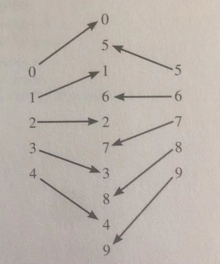
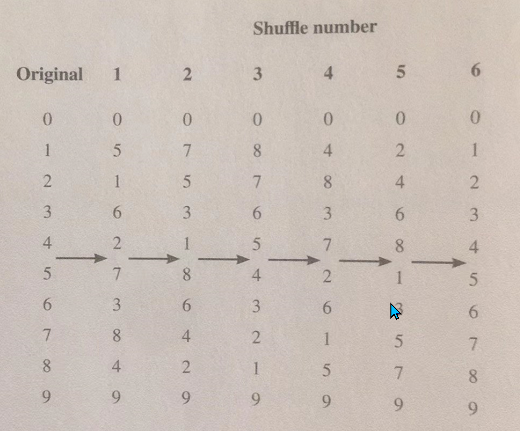

Consider a deck of n cards where n is even and each card is uniquely labeled from 1 to n. 
A shuffle is performed when the deck is divided into two stacks and the stacks are interlaced so that a new stack is formed by alternately taking cards from each stack. 
For instance, a deck of ten cards is in order when the card labeled 0 is on the top of the deck and the card labeled 9 is on the bottom of the deck:
dividing the deck in half produces two stacks of cards—one stack with cards 0 through 4, the other with cards 5 through 9. Interlacing the stacks produces a deck in the following order: 



The number of times needed to shuffle the deck until it returns to its original order is called the reorder count. Note that the reorder count for a deck of ten cards is six: 



A deck is modeled by the following incomplete declaration of the Deck class: 

```java
public class Deck 
{
    private int [ ] cards; 

    public Deck (int[] newcards) 
    { /* code not shown*/ } 

    public boolean inOrder( ) 
    { /* to beimplemented in part (a) */}

    public void shuffle ( ) 
    {/* to be    implemented in part (b) */ }

    public int reorderingCount() 
    {/* to be implemented in part (c) */}

}
```

(a) Write the Deck method inOrder. Method inOrder should return true if the cards in the deck are in numerical order from 0 to cards.length - 1 and should return false otherwise. Cards are in numerical order if cards [k] == k for all 0 <= k < cards.length.

Complete method inOrder below. 

```java
// precondition: For all k such that 
//0<= k<cards.length, 
// 0<= cards[k] < cards.length and 
// each card [k] is unique 
// postcondition: returns true if 
// cards[k]== k for all
// 0 <= k < cards.length; returns 
// false otherwise 
public boolean inOrder () 
```

(b) Write the Deck method shuffle. This method should divide the deck into two equal stacks and interlace them evenly as described at the beginning of this question. 

Complete method shuffle below. 

```java
// postcondition: the deck is shuffled by 
// dividing the deck into two equal stacks 
// that are evenly interlaced 
public void shuffle ( ) 
```

(c) Write the Deck method reorderCount. Method reorderCount should return the number of shuffles necessaiyto return the deck to its origirm al order. 

In writing method reorderCount t You may use the methods inOrder and shuffle as specified in parts (a) and (b). Assume that inOrder and shuffle work as specified, regardless of what you wrote in parts (a) and (b). Solutions that reimplement functionality provided by these methods, rather than invoking them, will not receive full credit.

Complete method reorderCount below. 

```java
// postcondition: returns the number of 
// shuffles necessary to return the cards 
// in the deck to their original numerical 
// order such that inOrder () ==true; the
// cards in the deck are in their original 
// numerical order 
public int reorderCount()  


```