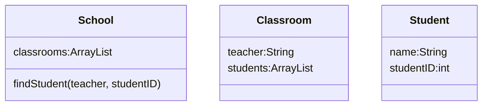

Consider a school that contains x number of students that all start their first period class in one of n classrooms. This scenario can be represented using three classes. The School class contains an array of all the classrooms in the school. The Classroom class has fields for the teacher in charge of the room teacherName and an array of all the Students in the classroom students. The student class has a field for the name of the student studentName and the ID number of the student studentID.

The School class contains a method findStudent that takes a teacher’s name and a student ID as arguments and returns the name of the student. The method utilizes a sequential search algorithm to find the correct classroom and a binary search algorithm to find the correct student. If the student is not found in the classroom of which the given teacher is in charge, the methodretums “student Not Found.” 

Write the complete School, classroom, and Student classes, including any instance variables, constructors, and necessary methods. You may assume that the student ID numbers in each classroom are sorted in ascending order. 

