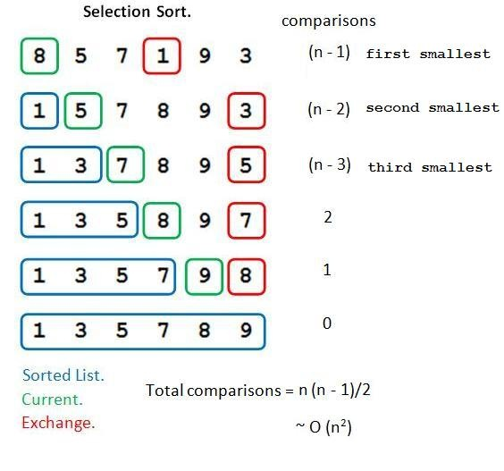

# AP COMPUTER Quiz Answer Sheet
  
## Answers for Quizes
* quiz01
 
    1E, 2D, 3E, 4C, 5E
    [Quiz1 Questions](quiz01.md)
* quiz02
 
    1C, 2A, 3B, 4D, 5D
    [Quiz2 Questions](quiz2.md)
* quiz03
 
    1C, 2D, 3A, 4C, 5B
    [Quiz3 Questions](quiz3.md)
* quiz04
 
    1B, 2D, 3C, 4B, 5D
    [Quiz4 Questions](quiz4.md)
* quiz05
 
    1D, 2B, 3E, 4D, 5D
    [Quiz5 Questions](quiz5.md)
* quiz06
 
    1C, 2E, 3E, 4B, 5D
    [Quiz6 Questions](quiz6.md)
* quiz07
 
    1A, 2C, 3E, 4A, 5D
    [Quiz7 Questions](quiz7.md)
* quiz08
 
    1B, 2D, 3B, 4D, 5C
    [Quiz8 Questions](quiz8.md)
* quiz09
 
    1B, 2D, 3E, 4B, 5D
    [Quiz9 Questions](quiz9.md)
* quiz10
 
    1A, 2C, 3B, 4A, 5C
    [Quiz10 Questions](quiz10.md)

 * quiz11
 
    1C, 2E, 3E, 4C, 5B
    [Quiz11 Questions](quiz11.md)

* quiz12
 
    1E, 2B, 3E, 4B, 5E
    [Quiz12 Questions](quiz12.md)

* quiz13
 
    1E, 2E, 3A, 4A, 5E
    [Quiz13 Questions](quiz13.md)

* quiz14
 
    1D, 2C, 3D, 4C, 5C
    [Quiz14 Questions](quiz14.md)

* quiz15
 
    1D, 2B, 3A, 4B, 5E
    [Quiz15 Questions](quiz15.md)

* quiz16
 
    1A, 2A, 3B, 4C, 5B
    [Quiz16 Questions](quiz16.md)

* quiz17
 
    1A, 2B, 3E, 4C, 5A
    [Quiz17 Questions](quiz17.md)
    
* quiz18
 
    1C, 2E, 3A, 4E, 5B
    [Quiz18 Questions](quiz18.md)

There are three sort algorithm need to know in AP Exam.
1. Selection sort
2. Insertion sort
3. Merge sort

🔑😄 **Knowlodge Base** Complexity measures
1. Ω. Big Omega is used to represent the **best-case** scenario of an algorithm. When an algorithm is given the simplest data-structure possible as input.
2. O. BigO is used to represent the **worst-case** scenario of an algorithm. When an algorithm is given a very large and complex data-set as input.
3. Θ. Big Theta is used only when the time complexity of an algorithm is the same in both worst-case and best-case scenarios.

### Selection sort
Search-and-swap.




$$\frac 1 2 n(n-1)$$

Time Complexity: O(n²), Ω(n)


### bubble sort


Bubble sort is a simple sorting algorithm that continuously steps through the list and compares the adjacent pairs to sort the elements. In contrast, selection sort is a sorting algorithm that takes the smallest value (considering ascending order) in the list and moves it to the proper position in the array.


### Insertion Sort


$$\frac 1 2 n(n-1)$$

Time Complexity: O(n²), Ω(n)

compare-push-insert
{8,6,7,10} (8>6)
{8>,,7,10} >> {6,8,7,10}
{6,8>,,10} (8>7) >> {6,7,8,10}
{6,7,8,} (10>8) >> {6,7,8,10}

🔑😄 **Knowlodge Base**
The main difference between insertion sort and selection sort is that insertion sort performs sorting by exchanging an element at a time with the partially sorted array while selection sort performs sorting by selecting the smallest element from the remaining elements and exchanging it with the element in the correct location.


### Merge Sort

🔑😄 **Knowlodge Base**
Merge Sort is considered to be one of the **fastest** sorting algorithms, it is a bit more complex than Selection and Bubble Sort but its more efficient.


Time Complexity: Θ(n log n)

```
{14,8,9,3,5,4,21,12}
{14,8,9,3}               {5,4,21,12}
{14,8} {9,3}            {5,4} {21,12}
{14} {8} {9} {3}       {5} {4}  {21} {12}
{8,14} {3,9}            {4,5}  {12,21}  
{3,8,9,14}              {4,5,12,21}
       {3,4,5,9,12,14,21}
```


* quiz19
 
    1B, 2D, 3E, 4A, 5C
    [Quiz19 Questions](quiz19.md)

* quiz20
 
    1D, 2B, 3A, 4A, 5A
    [Quiz20 Questions](quiz20.md)

* quiz21
 
    1B, 2E, 3E, 4E, 5C
    [Quiz21 Questions](quiz21.md)

* quiz22
 
    1D, 2B, 3D, 4C, 5B
    [Quiz21 Questions](quiz22.md)

* quiz23
 
    1B, 2C, 3E, 4E, 5A
    [Quiz21 Questions](quiz23.md)

* quiz24
  
  1E, 2D, 3A, 4D, 5B
  [Quiz24 ](quiz24.md)

  1. Searching is usually more efficient using a binary search, provided the array is sorted. However, a binary search will require more than one comparison if the target is not in the middle, whereas a linear search will need only one comparison if the target is first in line. Therefore, each of the four situations presented in (A) through (D) could be the most efficient, depending on the position of the Twix. The answer is (E).

* quiz25

1A, 2B, 3D, 4B, 5D

[Quiz25](quiz25.md)

* quiz26 [page 265]
  
1B, 2D, 3C, 4A, 5B
[Quiz26](quiz26.md)

* quiz27 [page 269]
  
1C, 2D, 3B, 4D, 5D
[Quiz27](quiz27.md)

* quiz28 [page 269, 318]
  
1A, 2B, 3B, 4C, 5A
[Quiz28](quiz28.md)

* quiz29 [page 269]
  
1C, 2C, 3E, 4B, 5A
[Quiz29](quiz29.md)

* quiz30 [page 323]
  
1B, 2C, 3E, 4A, 5C
[Quiz30](quiz30.md)

* quiz31 [page 324]
  
1B, 2D, 3B, 4E, 5A
[Quiz31](quiz31.md)

* quiz32 [page 324]
  
1D, 2C, 3C, 4C, 5D
[Quiz32](quiz32.md)

* quiz33 [page 327]
  
1C, 2D, 3A, 4E, 5B
[Quiz33](quiz33.md)

* quiz34 [page 331]
  
1E, 2B, 3A, 4B, 5B
[Quiz34](quiz34.md)

* quiz35 [page 331]
  
1E, 2C, 3E, 4E, 5E
[Quiz35](quiz35.md)

* quiz36 [page 331]
  
1A, 2E, 3C, 4A, 5D
[Quiz36](quiz36.md)

* quiz37 [page 331]
  
1B, 2C, 3C, 4A, 5E
[Quiz37](quiz37.md)

* quiz38 [page 331]
  
1B, 2A, 3B, 4E, 5D
[Quiz38](quiz38.md)

* quiz39 [page 331]
  
1D, 2C, 3C, 4C, 5E
[Quiz39](quiz39.md)

* quiz40 [page 331]
  
1A, 2D, 3A, 4D, 5D
[Quiz40](quiz40.md)

* quiz41 [page 401]
  
1C, 2E, 3E, 4E, 5D
[Quiz41](quiz41.md)

* quiz42 [page 401]
  
1B, 2B, 3E, 4E, 5D
[Quiz42](quiz42.md)

* quiz43 [page 401]
  
1B, 2B, 3E, 4C, 5C
[Quiz43](quiz43.md)

* quiz44 [page 401]
  
1A, 2D, 3E, 4E, 5E
[Quiz44](quiz44.md)

## Section II 
* [Problem 01](sectionII-01.md) ⟶ [](../ap2021/src/section2/Experiment.java)
* [Problem 02](sectionII-02.md) ⟶ [](../ap2021/src/section2/WordSet.java)
* [Problem 03](sectionII-03.md) ⟶ [](../ap2021/src/section2/Tournament.java)
* [Problem 04](sectionII-04.md) ⟶ [](../ap2021/src/section2/HungryChameleon.java)
* [Problem 05](sectionII-05.md) ⟶ [](../ap2021/src/section2/DiceSimulation.java)
* [Problem 06](sectionII-06.md) ⟶ [](../ap2021/src/section2/CalorieCount.java)
* [Problem 07](sectionII-07.md) ⟶ [](../ap2021/src/section2/TravelPlan.java)
* [Problem 08](sectionII-08.md) ⟶ [](../ap2021/src/section2/SeatingChart.java)
* [Problem 09](sectionII-09.md) ⟶ [](../ap2021/src/section2/SeatingChart.java)
* [Problem 10](sectionII-10.md) ⟶ [](../ap2021/src/section2/FrogsSimulation.java)
* [Problem 11](sectionII-11.md) ⟶ [](../ap2021/src/section2/WordPairList.java)
* [Problem 12](sectionII-12.md) ⟶ [](../ap2021/src/section2/CodeWordChecker.java)
* [Problem 13](sectionII-13.md) ⟶ [](../ap2021/src/section2/ColorGrid.java)
* [Problem 14](sectionII-14.md) ⟶ [Page 334](../ap2021/src/section2/Problem14.java)
* [Problem 15](sectionII-15.md) ⟶ [Page 336](../ap2021/src/section2/Problem15.java)
* [Problem 16](sectionII-16.md) ⟶ [Page 339](../ap2021/src/section2/Problem16.java)
* [Problem 17](sectionII-17.md) ⟶ [Page 342](../ap2021/src/section2/Problem17.java)
* [Problem 18](sectionII-18.md) ⟶ [Page 342](../ap2021/src/section2/Problem18.java)
* [Problem 19](sectionII-19.md) ⟶ [Page 342](../ap2021/src/section2/Problem19.java)
* [Problem 20](sectionII-20.md) ⟶ [Page 342](../ap2021/src/section2/Problem20.java)
* [Problem 21](sectionII-21.md) ⟶ [Page 342](../ap2021/src/section2/Problem21.java)

