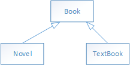

1. Consider this inheritance hierarchy, in which Novel and TextBookare subclasses of Book.

<div>
<center></center>
<div>

Which of the following is a false statement about the classes shown?

(A) The Textbook class can have private instance variables that are in neither Boook nor Novel.

(B) Each of the classes &#x2501;Book, Novel, and Textbook&#x2501; can have a method computeShelfLife, whose code in Book and Novel is identical, but different from code in TextBook.

(C) If the Book class has private instance variables myTitle and myAuthor, then Novel and Textbook inherit them but cannot direcly access them.

(D) Both Novel and Textbook inherit the construtors in Book.

(E) If the Book class has a private method called readFile, this method may not be accessed in either the Novel or Textbook classes.

2. A programmer is designing a program to catalog all books in a library. He plans to have a Book class that stores features of each book: author, title, isOnShelf, and so on. with operations like getAuthor, getTitle, getShelfInfo, and setShelfInfo. Another class, LibraryList, will store an array of Book objects. The LibraryList class will include operations such as listAllBooks, addBook, removeBook, and searchForBook. The programmer plans to implement and test the Book class first, before implementing the LibraryList class. The programmer's plan to write the Book class first is an example of
```
(A) top-down development.
(B) bottom-up development.
(C) procedural abstraction.
(D) information hiding.
(C) a driver program.
```
Refer to the following classes for Question 3 and 4.
```java
public class Card {
	private String mySuit;
	private int myValue; //0 to 12
	
	public Card(String suit, int value) {
        /* implementation */
	}

	public String getSuit() {
		return mySuit;
	}

	public int getValue() {
		return myValue;
	}

	@Override
	public String toString() {
		String faceValue = "";
		if(myValue == 11)
			faceValue = "J";
		else if(myValue == 12)
			faceValue = "Q";
		else if(myValue == 0)
			faceValue = "K";
		else if(myValue == 1)
			faceValue = "A";
		if(myValue>=2 && myValue<=10)
			return myValue + " of " + mySuit;
		else
			return faceValue + " of " + mySuit;	
	}
}

public class Deck {
	private Card[] myDeck;
	public final static int NUMCARDS = 52;
	
	public Deck() {
		
	}
	
	public void shuffle() {
		
	}

```

3. Which of the following represents correct /* implementation */ code for the constructor in the Card class?

```
(A) mySuit = suit; 
    myValue = value;
(B) suit = mySuit;
    value = myValue;
(C) Card = new Card(mySuit, myValue);
(D) Card = new Card(suit, value);
(E) mySuit = getSuit();
    myValue = getValue();
```
4. Consider the implementation of a writeBeck method that is added to a Deck class.
```java
//Write the cards in myDeck, one per line.
public void writeDeck(){
    /* implementation */
}
```
```
Which of the following is correct /* implementation */?
I. System.out.println(myDeck)
II. for (Card card : myDeck)
        System.out.println(card)
III. for (Card card : myDeck)
        System.out.println((String) card)

(A) I only
(B) II only
(C) III only
(D) I and III only
(E) II and III only
```

5. Refer to the following method that finds the smallest value in an array.

```java
//Precondition: arr is initialized with int values
//Postcondition: Returns the smalles value in arr
public static int findMin(int[] arr){
    int min = /* some value */;
    int index = 0;
    while(index < arr.length){
        if (arr[index] < min)
            min = arr[index];
        index ++;
    }
    return min
}
```
Which replacement(s) for /* some value */ will always result in correctexecution of the findMin method?
```
I. Integer.MIN_VALUE
II. integer.MAX_VALUE
III. arr[0]

(A) I only
(B) II only
(C) III only
(D) I and III only
(E) II and III only
```
Refer to the following class for Question 6 and 7.
```java
public class Tester
{
    private int[] testArray = {3,4,5};

    //Add 1 to n
    public void increment(int n) {
    	n++;
    }
    
    public void firstTestMethod() {
    	for(int i=0; i<testArray.length; i++) {
    		increment(testArray[i]);
    		System.out.print(testArray[i] + " ");
    	}
    }
    
    public void secondTestMethod() {
    	for(int element : testArray) {
    		increment(element);
    		System.out.print(element + " ");
    	}
    }
}
```
6. What output will be produced by invoking firstTestMethod for a Tester object?
```
(A) 3 4 5
(B) 4 5 6
(C) 5 6 7
(D) 0 0 0
(E) No output will be produced. An ArrayIndexOutOfBoundsException will be thrown.
```
7. What output will be produced by invoking secondTestMethod for a Tester object, assume that testArray contains 3, 4, 5?
```
(A) 3 4 5
(B) 4 5 6
(C) 5 6 7
(D) 0 0 0
(E) No output will be produced. An ArrayIndexOutOfBoundsException will be thrown.
```
8. Consider the following loop, where n is some positive integer.
```java
for (int i=0; i<n; i+=2){
    if(/*test*/){
        /* perform some action */
    }
}
```
In terms of n, which Java expression represents the maximum number of times that /* perform some action */ could be executed?
```
(A) n/2
(B) (n + 1) / 2
(C) n
(D) n - 1
(E) (n-1)/2
```

9. A method is to be written to search an array for a value that is larger that a given item and return its index. The problem specification does not indicate what should be returned if there are several such values in the array. Which of the following actions would be best?

(A) The method shold be written on the assumption that there is only one value in the array that is larger than the given item.

(B) The method should be written so as to return the index of every occurrence of a larger value.

(C) The specification should be modified to indicate what should be done if there is more than one index of larger value.

(D) The method should be written to output a message if more than one larger value is found.

(E) The method should be written to delete all subsequent larger items after a suitable index is returned.

10. When will method whatIsIt cause a stack overflow(i.e., cause computer memory to be exhausted)?
```java
public static int whatIsIt(int x, int y){
    if(x>y)
        return x* y;
    else
        return whatIsIt(x-1, y)
}
```

```
(A) Only when x < y
(B) Only when x ≤ y
(C) Only when x > y
(D) For all values of x and y
(E) The method will never cause a stack overflow.
```

11. The boolean expression a[i] == max || !(max != a[i]) can be simplified to
```
(A) a[i] == max
(B) a[i] != max
(C) a[i] < max || a[i] > max
(D) true
(E) false
```

12. Suppose the charqacters 0,1,...,8,9,A,B,C,D,E,F are used to represent a hexadecimal (base-16) number. Here A=10, B=11, ..., F=15. What is the largest base-10 integer that can be represened with a two-digit hexadecimal number,such as 14 or 3A?
```
(A) 32
(B) 225
(C) 255
(D) 256
(E) 272
```