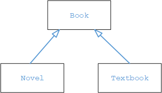

# Quiz 15

1. Consider this inheritance hierarchy, in which Novel and Textbook are subclasses of Book. 



Which of the following is a false statement about the classes shown? 

(A) The Textbook class can have private instance variables that are in neither Book nor Novel, 

(B) Each of the classes—Book, Novel, and Textbook—can have a method computeShelfLife, whose code in Book and Novel is identical, but different from the code in Textbook. 

(C) If the Book class has private instance variables myTitle and my Author, then Novel and Textbook inherit them but cannot directly access them. 

(D) Both Novel and Textbook inherit the constructors in Book. 

(E) If the Book class has a private method called readFile, this method may not be accessed in either the Novel or Textbook classes. 

2. A programmer is designing a program to catalog all books in a library. He plans to have a Book class that stores features of each book: author, title, isOnShelf, and so on, with operations like getAuthor, getTitle, getShelflnfo, and setShelf Info. Another class, LibraryList, will store an array of Book objects. The LibraryList class will include operations such as listAHBooks, addBook, removeBook, and searchForBook. The programmer plans to implement and test the Book class first, before implementing the LibraryList class. The programmer’s plan to write the Book class first is an example of 

(A) top-down development. 

(B ) bottom-up development. 

(C) procedural abstraction. 

(D) information hiding. 

(E) a driver program. 

Questions 3-4 refer to the Card and Deck classes shown below. 

```java
public class Card 
{
    private String mySuit; 
    private int myValue; //O to 12 

    public Card (String suit, int value )
    {
        /* implementation */
    }

    public String getSuit () 
    { return mySuit; } 

    public int getValue()
    { return myValue;}

    public String toString()
    {
        String faceValue = "";
        if (myValue == 11) 
            faceValue= "J" ;
        else if(myValue == 12)
            faceValue= "Q" ;
        else if(myValue == 0)
            faceValue= "K" ;
        else if(myValue == 1)
            faceValue= "A" ;
        if (myValue >= 2 && myValue <= 10)
            return myValue + " of " + mySuit;
        else
            return faceValue + " of " + mySuit;

    }
}

public class Deck 
{
    private Card[] myDeck;
    Public final static int NUMCARDS = 52 ;

    public Deck() 
    {...

    }
    //Simulate shuffling the deck. 
    public void shuffle () 
    {
        ...
    }
    //other methods not shown ...
}
```

3. Which of the following represents correct /* implementation */ code for the constructor in the Card class? 
   
```java
(A) mySuit = suit; 
    myValue = value; 
(B) suit = mySuit; 
    value = myValue; 
(C) Card = new Card (mySuit, my Value); 
(D) Card= new Card (suit, value) ; 
(E) mySuit= getSuit();
    myValue = getValue();  
```

4. Consider the implementation of a writeDeck method that is added to the Deck class.

```java
//Write the cards in. myDeck, one per line. 
public void writeDeck()
{
    /* implementation code */ 
} 
```

Which of the following is correct /* implementation code */?

```java
I System.out.printin(myDeck); 
II for (Card card : myDeck) 
    System.out.println(card); 
III for (Card card : myDeck)     
        System.out.printIn((String) card) ; 

(A) I only 
(B) II only
(C) III only 
(D) I and III only
(E) II and III only
```

5. Refer to the following method that finds the smallest value in an array. 

```java
//precondition: arr is initialized with int values. 
//Postcondition: Returns the smallest value in arr. 
public static int findMin(int[] arr )
{
    int min = /* some value */
    int index = 0;
    while (index< arr.length) 
    {
        if (arr[index] < min)
            min = arr[index]; 
        index++;
    }
    return min;
}
```

Which replacement(s) for /* some value */ will always result in correct execution of the findMin method? 

I integer.MIN_VALUE 

II Integer.MAX_VALUE 

III arr[0]

(A) I only 

(B) II only

(C) III only 

(D) I and III only

(E) II and III only

