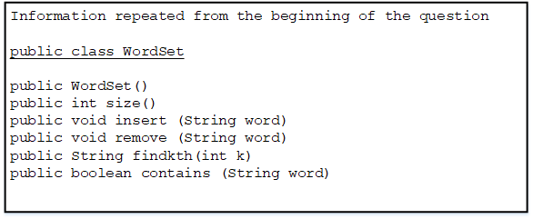

# SectionII 2

2. A WordSet, shown in the class declaration below, stores a set of String objects in no particular order and contains no duplicates. Each word is a sequence of capital letters only. 

```java
public class WordSet 
{
    /**
    * Constructor initializes set to empty
    */
    public WordSet()
    { /* implementation not shown */ } 

    /**
    * ©return the number of words in set 
    */
    public int size() 
    { /* implementation not shown*/ } 

    /**
    * Adds word to set (no duplicates) 
    * @param word the word to be added 
    */
    public void insert (String word) 
    { /* implementation not shown*/ } 

    /**
    * Removes word from set if present, else does nothing 
    * @param word the word to be removed
    */
    public void remove (String word) 
    { /* implementation not shown*/ } 

    /**
    * Returns kth word in alphabetical order, where 1 <=k<=size(),
    * @param k position of word to be returned
    * @return the kth word 
    */
    public String findkth(int k) 
    { /* implementation not shown*/ } 

    /**
    * @returntrue if set contains word, false otherwise 
    */
    public boolean contains (String word) 
    { /* implementation not shown*/ } 

    //There may be instance variables, constructors, and methods 
    //that are not shown.
}
```

The findkth method returns the kth word in alphabetical order in the set, even though the implementation of WordSet may not be sorted. The number k ranges from 1 (corresponding to first in alphabetical order) to N, where N is the number of words in the set. For example, if WordSet s stores the words {"GRAPE", "PEAR", "FIG", "APPLE"}, here are the values when s.findkth(k) is called. 

 k |values of s.findkth(k) 
 |---|---|
 1 | APPLE
 2 | FIG
 3 | GRAPE
 4 | PEAR

 (a) Write a client method countA that returns the number of words in WordSet so that begin with the letter “A”. In writing countA, you may call any of the methods of the WordSet class. Assume that the methods work as specified. 

 Complete method countA below. 

 ```java
    /**
    * @param s the current WordSet 
    * @return the number of words in s that begin with "A"
    */
    public static int countA (WordSet s)  
 ```

 (b) Write a client method removeA that removes all words that begin with "A". If there are no such words in s, then removeA does nothing. In writing removeA, you may call method countA specified in part (a). Assume that countA works as specified, regardless of what you wrote in part (a). 

 

Complete method removeA below: 

```java
/**
* @param s the current WordSet 
* Postcondition: WordSet s contains no words that begin with "A",
*                but is otherwise unchanged. 
*/
public static void removeA (WordSet s)  
```

(c) Write a client method commonElements that returns the WordSet containing just those elements occurring in both of its WordSet parameters. 

for example, if s1 is {"BE", "NOT", "AFRAID"} and s2 is {"TO", "BE", "OR", "NOT"}, then commonElements(sl, s2) should return the WordSet {"BE", "NOT"}. (If you are familiar with mathematical set theory, commonElements returns the intersection of s1 and s2. 

Complete method commonElements below. 

```java
/**
* @param s1 the first given set 
* @param s2 the second given set 
* Oreturn the WordSet containing only the elements that occur 
* in both s1 and s2
*/
public static WordSet commonElements (WordSet s1, WordSet s2)  
```