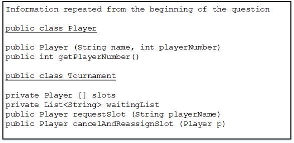

# AP Computer Science A, Section II, problem 3

3. In this question you will implement two methods for a class Tournament that keeps track of the players who have registered for a tournament. The Tournament class uses the Player class shown below. A Player has a name and player number specified when a player is constructed. 

```java
public class Player 
{
    public Player(String name, int playerNumber) 
    { /* implementation not shown */ }

    public int getPlayerNumber () 
    { /* implementation not shown*/ } 

    //private instance variables and other methods not shown 
}
```

An incomplete declaration for the Tournament class is shown below. There are 100 available slots for players in the tournament, and the players are numbered 0,1,2,...,99. 

```java
public class Tournament 
{
    /** The list of slots in the tournament. 
    * Each element corresponds to a slot in the tournament. 
    * If slots[i] is null, the slot is not yet taken; 
    * otherwise it contains a reference to a Player. 
    * For example, slots[i].getPlayerNumber() returns i. */ 
    private Player[] slots; 

    /** The list of names of players who wish to participate in 
    the tournament, but cannot because all slots are taken. */
    private List<String> waitingList;

    /**
    * If there are any empty slots (slots with no Player) 
    * assign the player with the specified playerName to an 
    * empty slot. Create and return the new Player. 
    * If there are no available slots, add the player's name 
    * to the end of the waiting list and return null. 
    * @playerName the name of the person requesting a slot 
    * @return the new player 
    */
    public Player requestSlot (String playerName) 
    { /* to be implemented in part (a) */ } 

    /**
    * Release the slot for player p, thus removing that player 
    * from the tournament. If there are any names in waitingList, 
    * remove the first name and create a Piayer in the 
    * canceled slot for this person. Return the new Player. 
    * If waitingList is empty > mark the slot specified by p as 
    * empty and return null. 
    * precondition: p is a valid Player for some slot in this 
    *               tournament. 
    * @param p the player who will be removed from the tournament 
    * @return the new Player placed in the canceled slot 
    */
    public Player cancelAndReassignSlot (player p) 
    { /* to be implemented in part (b) */ }

    // constructor and other methods not shown.  
}
```

(a) Write the Tournament method request Slot. Method request Slot tries to reserve a slot in the tournament for a given player. If there are any available slots in the tournament, one of them is assigned to the named player, and the newly created player is returned. If there are no available slots, the player’s name is added to the end of the waiting list and null is returned. 

Complete method requestslot below. 

```java
/**
 * If there are any empty slots (slots with no Player) 
 * assign the player with the specified playerName to an 
 * empty slot. Create and return the new Player. 
 * If there are no available slots, add the player’s name 
 * to the end of the waiting list and return null. 
 * @playerName the name of the person requesting a slot
 * @return the new player
 */
 public Player requestSlot (String playerName)   
```

(a) Write the Tournament method cancelAndReassignSlot. This method releases a previous player’s slot. If the waiting list for the tournament contains any names, the newly available slot is reassigned to the person at the front of the list. That person’s name is removed from the waiting list and the newly created Player is returned. If the waiting list is empty, the newly released slot is marked as empty and null is returned. 

In writing cancelAndReassignSlot you may use any accessible methods in the Player and Tournament classes. Assume that these methods work as specified. 




Complete method cancelAndReassignSlot below. 

```java
/**
 * Release the slot for player p, thus removing that player 
 * from the tournament. If there are any names in waitingList, 
 * remove the first name and create a Player in the 
 * canceled slot for this person. Return the new Player. 
 * If waitingList is empty, mark the slot specified by p as 
 * empty and return null. 
 * precondition: p is a valid Player for some slot in this 
 *               tournament. 
 * @param p the player who will be removed from the tournament 
 * @return the new Player placed in the canceled slot 
 */
public Player cancelAndReassignSlot (Player p) 
```