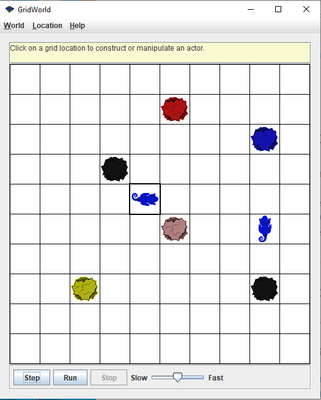

# AP Computer Science A, Section II

[GridWorld Case Study](https://apcentral.collegeboard.org/courses/ap-computer-science-a/classroom-resources/gridworld-case-study)

[Gridword case on YouTube](https://www.youtube.com/watch?v=pF0HFYtbLLI)

4. This question involves reasoning about the code from the GridWorld Case Study A Quick Reference to the case study is provided as part of this exam. 

Consider defining a new kind of ChameleonCritter, a HungryChameleon, that attempts to eat a Bug when it acts. If it succeeds in eating a bug, a HungryChameleon does not change color. If it fails to eat, then it changes color in the same way a ChameleonCritter does. After eating or changing color, a HungryChameleon moves like a ChameleonCritter. Here is a partial definition of the class HungryChameleon. 

```java
/**
* A Hungry Chameleon eats neighboring bugs if there are any; 
* otherwise it takes on the color of neighboring actors as it 
* moves through the grid. 
*/
public class HungryChameleon extends ChameleonCritter
{
    /**
    * Gets a list of adjacent bugs. 
    * @param actors the list of all adjacent neighbors 
    * @return a list of adjacent bugs 
    */
    private ArrayList<Bug> getBugs (ArrayList<Actor> actors)
    { /* to be implemented in part (a) */ } 

    /**
    * Randomly "eats" one of the bugs in the list of bugs
    * Precondition: bugs.size() > 0. 
    * @param bugs the list of adjacent bugs 
    */
    private void eatBug(ArrayList<Bug> bugs)
    { /* to be implemented in part (b) */ } 

    /**
    * Gets a list of adjacent neighboring bugs and eats one.
    * If there are no bugs to eat, the HungryChame 1 eon takes
    * on the color of a neighboring actor. 
    * @param actors the list of all adjacent neighbors 
    */
    public void processActors(ArrayList<Actor> actors)
    { /* to be implemented in part (c) */ }

}
```

(a) Write the private HungryChameleon method getBugs. This method should return a list of adjacent neighboring actors that are bugs. 

Complete method getBugs below. 

```java
/**
 * Gets a list of adjacent bugs. 
 * @param actors the list of all adjacent neighbors 
 * @return a list of adjacent bugs
*/
private Arraylist<Bug> getBugs (ArrayList<Actor> actors)
```

(b) Write the private HungryChameleon method eatBug. Method eatBug randomly selects a Bug from its bugs parameter and “eats”(i.e., removes) it. 

Complete method eatBug below. 

```java
/**
 * Randomly "eats" one of the bugs in the list of bugs. 
 * precondition: bugs.size() > 0.
 * @param bugs the list of adjacent bugs 
 */
private void eatBug(ArrayList<Bug> bugs) 
```

(c) Override the processActors method of the ChameleonCritter superclass. A HungryChameleon processes actors by getting a list of neighboring bugs and randomly selecting one to eat. If there are no bugs to eat, the HungryChameleon takes on the color of one of its neighbors, behaving just like a ChameleonCritter. 

Complete method processActors below. 

```java
/**
 * Gets a list of adjacent neighboring bugs and eats one. 
 * If there are no bugs to eat, the HungryChameleon takes 
 * on the color of a neighboring actor. 
 * @param actors the list of all adjacent neighbors 
 */
 public void processActors(Arraylist<Actor> actors)
```



Before you starting code your code,

1. Determine which method is the very first application entry point;
2. Focus on the argument list and try to prepare for them;
3. Find relationship between all methods, who cal who? what to do?
4. Try to add 3 comments line in main to build calling structure.