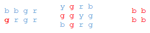
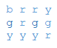

# SectionII 09

A color grid is defined as a two-dimensional array whose elements are character strings having values "b" (blue), "r" (red), "g" (green), or "y" (yellow). The elements are called pixels because they represent pixel locations on a computer screen. For example, example, 


A connected region for any pixel is the set of all pixels of the same color that can be reached through a direct path along horizontal or vertical moves starting at that pixel. A connected region can consist of just a single pixel or the entire color grid. For example, if the two-dimensional array is called pixels, the connected region for pixels[1][0] is as shown here for three different arrays. 



The class ColorGrid, whose declaration is shown below, is used for storing, displaying, and changing the colors in a color grid. 

```java
public class ColorGrid
{
    private String[][] myPixels;
    private int myRows; 
    private int myCols;

    /**
     * Creates numRows x numCols ColorGrid from String s.   
     * @param s the string containing colors of the ColorGrid 
     * @param numRows the number of rows in the ColorGrid 
     * @param numCols the number of columns in the ColorGrid 
     */
     public ColorGrid(String s, int numRows, int numCols) 
     { /* to be implemented in part (a) */ } 

     /**
      * Precondition: myPixels[row][col] is oldColor, one of "r",
      *               "b", "g", or "y".
      *               newColor is one of "r", "b", "g", or "y"
      * Postcondition: if 0 <= row < myRows and 0 <= col < myCols,
      *               paints the connected region of
      *               myPixels[row][col] the newColor.
      *               Does nothing if oldColor is the same as 
      *               newColor.
      * @param row the given row
      * @param col the given column  
      * @param newColor the new color for painting 
      * @param oldColor the current color of myPixels[row][col] 
      */
      public void paintRegion(int row, int col, String newColor, String oldColor) 
      { /* to be implemented in part (b) */ } 

      //other methods not shown 

      // ...
} 
```

(a) Write the implementation code for the ColorGrid constructor. The constructor should initialize the myPixels matrix of the ColorGrid as follows: The dimensions of myPixels are numRows X numCols. String s contains numRows X numCols characters, where each character is one of the colors of the grid—"r", "g", ”b", or "y". The characters are contained in s row by row from top to bottom and left to right. For example, given that numRows is 3, and numCols is 4, if s is "brrygrggyyyr", myPixels should be initialized to be 



Complete the constructor below: 

```java
/**
 * Creates numRows x numCols ColorGrid from String s. 
 * @param s the string containing colors of the ColorGrid 
 * @param numRows the number of rows in the ColorGrid 
 * @param numCols the number of columns in the ColorGrid 
 */
 public ColorGrid (String s, int numRows,int numCols) 
```

(b) Write the implementation of the paintRegion method as started below. **Note: You must write a recursive solution.** The paintRegion paints the connected region of the given pixel, specified by row and col, different color specified by the newColor parameter. If newColor is the same as oldColor, the color of the given pixel, paintRegion does nothing. To visualize what paintRegion does, imagine that the different colors surrounding the connected region of a given pixel form a boundary. When paint is poured onto the given pixel, the new color will fill the connected region up to the boundary.

For example, the effect of the method call c.paintRegion (2. 3. "b", "r") on the ColorGridc is shown here. (The starting pixel is shown in a frame, and its connected region is shaded.)


Complete the method paint Region below. **Note: Only a recursive solution ■will be accepted.**

```java
     /**
      * Precondition: myPixels[row][col] is oldColor, one of "r",
      *               "b", "g", or "y".
      *               newColor is one of "r", "b", "g", or "y"
      * Postcondition: if 0 <= row < myRows and 0 <= col < myCols,
      *               paints the connected region of
      *               myPixels[row][col] the newColor.
      *               Does nothing if oldColor is the same as 
      *               newColor.
      * @param row the given row
      * @param col the given column  
      * @param newColor the new color for painting 
      * @param oldColor the current color of myPixels[row][col] 
      */
      public void paintRegion(int row, int col, String newColor, String oldColor) 
```