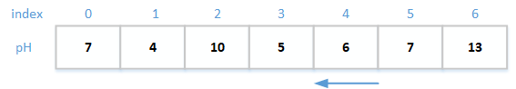
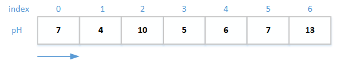
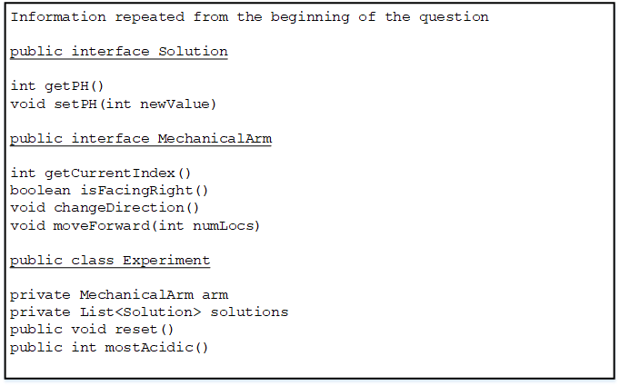
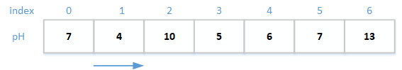
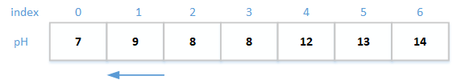
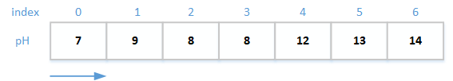

# SectionII 1

1. A chemical solution is said to be acidic if it has a pH integer value from 1 to 6, inclusive. The lower the pH, the more acidic the solution. An experiment has a large number of chemical solutions arranged in a line and a mechanical arm that moves back and forth along the line, so that the acidity of each solution can be altered by adding various chemicals. A chemical solution is specified by the solution interface below. 

```java
public interface Solution 
{
    /** Qreturn an integer value that ranges from 1 (very acidic) 
    * to 14 */ 
    int getPH();
    /** Set pH to newValue. 
    * @param newValue the new pH value */ 
    void setPH(int newValue); 
}
```

The experiment keeps track of the solutions and the mechanical arm. 
below represents the solutions and mechanical arm in an experiment. The arm, indicated by the arrow, is currently at index 4 and is facing left. The second row of integers represents the pH values of the solutions. 



In this experiment, the most acidic solution is at index 1, since its pH value is the lowest. 

The state of the mechanical arm includes the index of its location and direction it is facing (to the right or to the left). A mechanical arm is specified by the MechanicalArm interface below. 

```java
public interface MechanicalArm 
{
    /** @return the index of the current location of the 
    * mechanical arm */ 
    int getCurrentIndex ( );
    
    /** @return true if the mechanical arm is facing right 
    * (toward solutions with larger indexes), 
    * false if the mechanical arm is facing left 
    * (toward solutions with smaller indexes) 
    */
    boolean isFacingRight();
    /** Changes the current direction of the mechanicalarm */ 
    void changeDirection();

    /** Moves the mechanical arm forward in its current direction 
    * by the number of locations specified. 
    * @param numLocs the number of locations to move 
    * Precondition: numLocs> 0. */ 
    void moveForward(int numLocs);
}
```
An experiment is represented by the Experiment class shown below. 

```java
Public class Experiment 
{
    /** The mechanical arm used to process the solutions*/ 
    private MechanicalArm arm; 

    /** The list of solutions*/ 
    private List<Solution> solutions;

    /** Resets the experiment. 
    * Postcondition: The mechanicalarm has a current index of 0 
    *                and is facing right. 
    */
    public void reset() 
    {/* to be implemented in part (a) */} 

    /** Finds and returns the index of the most acidic solution
    * ©return index the location of the most acidic solution 
    * or -1 if there are no acidic solutions 
    * Postcondition: The mechanical arm is facing right, and its 
    *                current index is at the most acidic solution, 
    *                or at 0 if there are no acidic solutions. 
    */
    public int mostAcidic() 
    { /* to be implemented in part (b) */ } 
}
```
(a) Write the Experiment method reset that places the mechanical arm facing right, at index 0.

For example, suppose the experiment contains the solutions with pH values shown. The arrow represents the mechanical arm. 


A call to reset will result in 






Complete method reset below. 

```java
/** Resetsthe experiment. 
* Postcondition: The mechanicalarm has a current index of 0 
*                and is facingright. 
*/
public void reset()
```
(b) Write the Experiment method mostAcidic that returns the index of the most acidic solution and places the mechanical arm facing right at the location of the most acidic solution. A solution is acidic if its pH is less than 7. The lower the pH, the more acidic the solution. If there are no acidic solutions in the experiment, the mostAcidic method should return -1 and place the mechanicalarm at index 0, facing right. 

For example, suppose the experiment has this state:


A call to mostAcidic should return the value 1 and result in the following state for the experiment: 



If the experiment has this state, 



a call to most Acidic should return the value -1 and result in the following state for the experiment: 




Complete method reset below. 

```java
/** Finds and returns the index of the most acidic solution. 
* ©return index the location of the most acidic solution 
* or -1 if there are no acidic solutions
* postcondition: The mechanical arm is facing right, and its 
*                current index is at the most acidic solution, 
*                or at 0 if there are no acidic solutions.
*/
public int mostAcidic()  
```