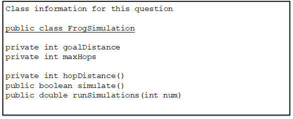

* This question involves reasoning about a simulation of a frog hopping in a straight line. The frog attempts to hop to a goal within a specified number of hops. The simulation is encapsulated in the following FrogSimulation class. You will write two of the methods in this class. 

```java
public class FrogSimulation 
{ 
    
    /** 
     * Distance, in inches, from the starting position to the goal. 
     */ 
    private int goalDistance; 
    
    /** Maximum number of hops allowed to reach the goal. */ 
    private int maxHops; 

    /** 
     * Constructs a FrogSimulation where dist is the distance, in inches, 
     * from the starting position to the goal, and numHops is the 
     * maximum number of hops allowed to reach the goal. 
     * Precondition: dist > 0; numHops > 0 
     */ 
    public FrogSimulation(int dist, int numHops) 
    { 
        goalDistance = dist; 
        maxHops = numHops; 
    } 

    /** 
     * Returns an integer representing the distance, in inches, 
    * to be moved when the frog hops. 
     */ 
    private int hopDistance() 
    {  /* implementation not shown */  } 

    /** 
    * Simulates a frog attempting to reach the goal as described in part (a). 
    * Returns true if the frog successfully reached or passed the goal 
    * during the simulation; false otherwise. 
    */ 
    public boolean simulate() 
    {  /* to be implemented in part (a) */  } 

    /** 
    * Runs num simulations and returns the proportion of simulations 
    * in which the frog successfully reached or passed the goal. 
    * Precondition: num > 0 
    */ 
    public double runSimulations(int num) 
    {  /* to be implemented in part (b) */  } 
} 
```
(a)  Write  the simulate method, which simulates the frog attempting to hop in a straight line to a goal from the frog's starting position of 0 within a maximum number of hops. The method returns **true** if the frog successfully reached the goal within the maximum number of hops; otherwise, the method returns false. 


TheFrogSimulation class provides a method called hopDistance that returns an integer representing the distance(positive or negative) to be moved when the frog hops. A positive distance represents a move toward the goal. A negative distance represents a move away from the goal. The returned distance may vary from call to call. Each time the frog hops, its position is adjusted by the value returned by a call to the hopDistance method. 

The frog hops until one of the following conditions becomes true: 

* The frog has reached or passed the goal. 
* The frog has reached a negative position. 
* The frog has taken the maximum number of hops without reaching the goal. 

The following example shows a declaration of a FrogSimulation object for which the goal distance is 24 inches and the maximum number of hops is 5. The table shows some possible outcomes of calling the simulate method. 

```java
FrogSimulation sim = new FrogSimulation(24, 5); 
```
|          |Values returned by hopDistance() |Final position of frog|Return value of  sim.simulate() |
|---|---|---|---|
|Example 1 |5,  7, -2,  8,  6 |24 |true |
|Example 2 |6,  7,  6,  6     |25 |true |
|Example 3 |6, -6, 31         |31 |true |
|Example 4 |4,  2, -8         |-2 |false|
|Example 5 |5,  4,  2,  4,  3 |18 |false| 



Complete method simulate below. You must use hopDistance appropriately to receive full credit. 

```java
/** 
 * Simulates a frog attempting to reach the goal as described in part (a). 
 * Returns true if the frog successfully reached or passed the 
 * goal during the simulation; false otherwise. 
 */ 
 public boolean simulate()
```

(b)  Write  therunSimulationsmethod, which performs a given number of simulations and returns the proportion of simulations in which the frog successfully reached or passed the goal. For example, if the parameter passed torunSimulations is 400, and 100 of the 400 simulate method calls returned true, then therunSimulationsmethod should return 0.25. 

Complete method runSimulations below. Assume that simulate works as specified, regardless of what you wrote in part (a). You must use simulate appropriately to receive full credit. 

```java
/** 
 * Runs num simulations and returns the proportion of simulations 
 * in which the frog successfully reached or passed the goal. 
 * Precondition: num > 0 
 */ 
 public double runSimulations(int num) 
 ```
