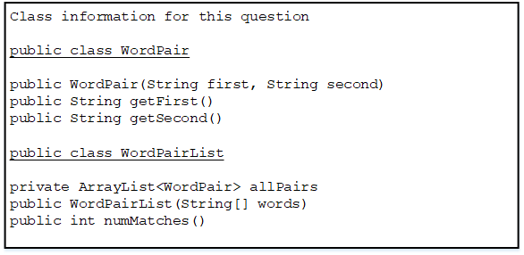

* This question involves reasoning about pairs of words that are represented by the following WordPair class.

```java
public class WordPair 
{ 
    /** Constructs a WordPair object. */ 
    public WordPair(String first, String second) 
    {  /* implementation not shown */  } 
    
    /** Returns the first string of this WordPair object. */ 
    public String getFirst() 
    {  /* implementation not shown */  } 
    
    /** Returns the second string of this WordPair object. */ 
    public String getSecond() 
    {  /* implementation not shown */  } 
} 
```

You will implement the constructor and another method for the following WordPairList class. 

```java
public class WordPairList 
{ 
    /** The list of word pairs, initialized by the constructor. */ 
    private ArrayList<WordPair> allPairs; 
    
    /** Constructs a WordPairList object as described in part (a). 
     * Precondition: words.length >= 2 
     */ 
    public WordPairList(String[] words) 
    { /* to be implemented in part (a) */ } 
    
    /** Returns the number of matches as described in part (b). 
     */ 
    public int numMatches() 
    { /* to be implemented in part (b) */ } 
}
``` 

(a)  Write the constructor for theWordPairListclass. The constructor takes an array of strings words as a parameter and initializes the instance variableallPairsto anArrayListof WordPair objects.

A WordPair object consists of a word from the array paired with a word that appears later in the array. The allPairs list contains WordPair objects (words[i], words[j]) for every i and j, where 0 <= i < j<words.length.  Each WordPair object is added exactly once to the list. 

The following examples illustrate two different WordPairList objects.

Example 1
```java
String[] wordNums = {"one", "two", "three"}; 
WordPairList exampleOne = new WordPairList(wordNums); 
```

After the code segment has executed, the allPairs instance variable of example One will contain the following WordPair objects in some order. 

("one", "two"), ("one", "three"), ("two", "three")

Example 2
```java
String[] phrase = {"the", "more", "the", "merrier"}; 
WordPairList exampleTwo = new WordPairList(phrase); 
```

After the code segment has executed, theallPairsinstance variable ofexampleTwowill contain the following WordPair objects in some order.

("the", "more"), ("the", "the"), ("the", "merrier"), ("more", "the"), ("more", "merrier"), ("the", "merrier") 



Complete the WordPairList constructor below.
```java
/** 
 * Constructs a WordPairList object as described in part (a). 
 * Precondition: words.length >= 2 
 */ 
 public WordPairList(String[] words)
``` 
(b)  Write  the WordPairList method numMatches. This method returns the number of WordPair objects in allPairs for which the two strings match. 

For example, the following code segment creates a WordPairList object.

```java
String[] moreWords = {"the", "red", "fox", "the", "red"}; 
WordPairList exampleThree = new WordPairList(moreWords);
```
After the code segment has executed, the allPairs instance variable of exampleThree will contain the following WordPair objects in some order. The pairs in which the first string matches the second string are shaded for illustration. 

<pre>
("the", "red"), ("the", "fox"), <span style="background-color:yellow;">("the", "the")</span>, 
("the", "red"), ("red", "fox"), ("red", "the"), 
<span style="background-color:yellow;">("red", "red")</span>, ("fox", "the"), ("fox", "red"), 
("the", "red")
</pre>


The call exampleThree.numMatches() should return 2.


Complete method numMatches below. 
```java
/** Returns the number of matches as described in part (b). 
 */ 
public int numMatches()
```