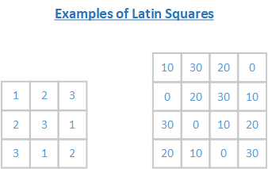
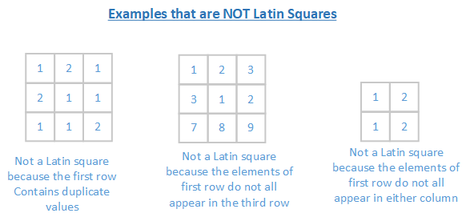
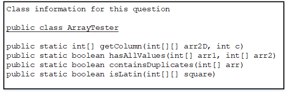

* This question involves reasoning about arrays of integers. You will write two static methods, both of which are in a class namedArrayTester.

```java
public class ArrayTester 
{ 
    /** 
     * Returns an array containing the elements of column c of arr2D in the same order as 
     * they appear in arr2D. 
     * Precondition: c is a valid column index in arr2D. 
     * Postcondition: arr2D is unchanged. 
     */ 
     public static int[] getColumn(int[][] arr2D, int c) 
     {  /* to be implemented in part (a) */  } 
     
     /** 
      * Returns true if and only if every value in arr1 appears in arr2. 
      * Precondition: arr1 and arr2 have the same length. 
      * Postcondition: arr1 and arr2 are unchanged. 
      */ 
      public static boolean hasAllValues(int[] arr1, int[] arr2) 
      {  /* implementation not shown */  } 
      
      /** 
       * Returns true if arr contains any duplicate values; 
       * false otherwise. 
       */ 
       public static boolean containsDuplicates(int[] arr) 
       {  /* implementation not shown */  } 
       
       /** 
        * Returns true if square is a Latin square as described in part (b); 
        * false otherwise. 
        * Precondition: square has an equal number of rows and columns. 
        * square has at least one row. 
        */ 
        public static boolean isLatin(int[][] square) 
        {  /* to be implemented in part (b) */  } 
    } 

```
(a)  Write a static methodgetColumn, which returns a one-dimensional array containing the elements of a single column in a two-dimensional array. The elements in the returned array should be in the same order as they appear in the given column. The notation arr2D[r][c]represents the array element at row r and column c. 

The following code segment initializes an array and calls thegetColumn method.

```java
int[][] arr2D = { { 0, 1, 2 }, 
                  { 3, 4, 5 }, 
                  { 6, 7, 8 }, 
                  { 9, 5, 3 } }; 
int[] result = ArrayTester.getColumn(arr2D, 1);
```

When the code segment has completed execution, the variable result will have the following contents.


result: {1, 4, 7, 5}

Complete method getColumn below. 

```java
/** 
 * Returns an array containing the elements of column c of arr2D in the same order as they 
 * appear in arr2D. 
 * Precondition: c is a valid column index in arr2D. 
 * Postcondition: arr2D is unchanged. 
 */ 
 public static int[] getColumn(int[][] arr2D, int c)
```

(b)  Write the static method isLatin, which returns true if a given two-dimensional square array is a Latin square, and otherwise, returns false. 

A two-dimensional square array of integers is a Latin square if the following conditions are true. 

* The first row has no duplicate values. 
* All values in the first row of the square appear in each row of the square. 
* All values in the first row of the square appear in each column of the square.

The ArrayTester class provides two helper methods: containsDuplicates and hasAllValues. The method containsDuplicates returns true if the given one-dimensional array arr contains any duplicate values and false otherwise. The method hasAllValues returns true if and only if every value in arr1 appears in arr2. You do **not** need to write the code for these methods. 





The ArrayTester class provides two helper methods: containsDuplicates and hasAllValues. The method containsDuplicates returns true if the given one-dimensional array arr contains any duplicate values and false otherwise. The method hasAllValues returns true if and only if every value in arr1 appears in arr2. You do not need to write the code for these methods. 



Complete method isLatin below. Assume that getColumn works as specified, regardless of what you wrote in part(a). You must use getColumn, hasAllValues, and containsDuplicates appropriately to receive full credit.

```java
/** 
 * Returns true if square is a Latin square as described in part (b); 
 * false otherwise. 
 * Precondition: square has an equal number of rows and columns. 
 * square has at least one row. 
 */ 
 public static boolean isLatin(int[][] square)
```
